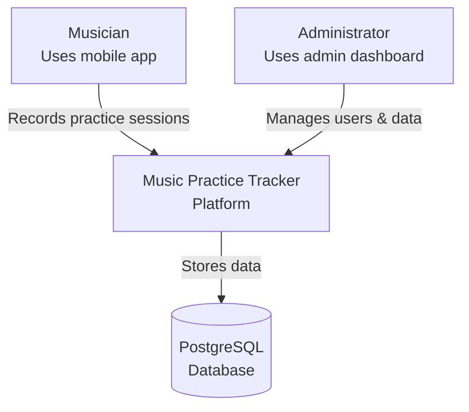
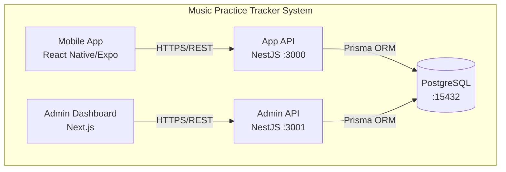

# Music Practice Tracker - System Architecture

## C4 Model Overview

### System Context

The Music Practice Tracker is a comprehensive platform for musicians to track and manage their practice sessions, with detailed metrics, goal tracking, and progress analytics.



### Container View



## Bounded Contexts

### 1. User Management Context

- **Responsibility**: User authentication, authorization, and profile management
- **Aggregates**: User
- **Services**: UserQueryService, UserCommandService, UserFacadeServices
- **Status**: ✅ Implemented

### 2. Practice Session Context

- **Responsibility**: Recording and managing practice sessions
- **Aggregates**: PracticeSession, PracticeSessionExercise
- **Services**: SessionQueryService, SessionCommandService, SessionFacadeServices
- **Status**: ⏳ In Progress

### 3. Instrument Management Context

- **Responsibility**: Managing musical instruments and user associations
- **Aggregates**: Instrument, UserInstrument
- **Services**: InstrumentQueryService, InstrumentCommandService
- **Status**: 📋 Planned

### 4. Goal & Progress Context

- **Responsibility**: Setting goals and tracking progress
- **Aggregates**: Goal, GoalProgress, ExerciseProgress
- **Services**: GoalQueryService, GoalCommandService, ProgressQueryService
- **Status**: 📋 Planned

## Key Architectural Patterns

### Domain-Driven Design (DDD)

- Clear aggregate boundaries with dedicated modules
- Service layer separation: Query (read) vs Command (write)
- Facade pattern for API-specific orchestration
- Repository pattern for all database access

### Layered Architecture

```
┌─────────────────────────────────┐
│   Presentation Layer (APIs)     │
├─────────────────────────────────┤
│   Application Layer (Facades)   │
├─────────────────────────────────┤
│   Domain Layer (Services)       │
├─────────────────────────────────┤
│   Infrastructure (Repository)   │
└─────────────────────────────────┘
```

### Service Patterns

Each aggregate implements:

1. **Repository Service**: Database access only
2. **Query Service**: Read operations with OrFail pattern
3. **Command Service**: Write operations (Create, Update, Delete)
4. **Facade Services**: API orchestration (Admin vs App)

## Data Flow

### Write Operations

```
Controller → Facade → Command Service → Query Service (validation) → Repository → Database
```

### Read Operations

```
Controller → Facade → Query Service → Repository → Database
```

## Security Boundaries

### API Separation

- **App API (port 3000)**: User-scoped operations, active records only
- **Admin API (port 3001)**: Full system access, includes deleted records

### Data Protection

- UUID public IDs (never expose internal IDs)
- Soft delete by default (data retention)
- Input validation at DTO level
- Rate limiting (planned)

## Technology Stack

### Core

- **Runtime**: Node.js 22.x + Bun (package management)
- **Language**: TypeScript 5.8.3 (strict mode)
- **Database**: PostgreSQL 15

### Backend

- **Framework**: NestJS 11.0.1
- **ORM**: Prisma 6.13.0
- **Validation**: class-validator, class-transformer
- **Documentation**: OpenAPI/Swagger

### Frontend

- **Mobile**: React Native 0.79.4 + Expo 53
- **Admin**: Next.js 15.3.3
- **Testing**: Jest, Cypress, Playwright

## Performance Considerations

### Database

- Connection pooling (max 200 connections)
- Indexes on frequently queried fields
- Soft delete pattern for data retention

### API

- Response time target: < 200ms
- Pagination for list endpoints
- Eager loading minimization

### Frontend

- Code splitting and lazy loading
- Image optimization
- 60fps animations target

## Deployment Architecture

### Development

- Docker Compose for PostgreSQL
- Local development servers
- Hot reload for all applications

### Production (Planned)

- Containerized deployments
- Load balancer for API servers
- CDN for static assets
- Database replication

## Integration Points

### Internal

- Shared TypeScript types via monorepo
- Generated API types from OpenAPI
- Shared ESLint/TypeScript configurations

### External (Planned)

- Authentication service (OAuth)
- Cloud storage for media files
- Analytics service
- Push notifications

## Monitoring & Observability (Planned)

### Metrics

- API response times
- Database query performance
- User engagement metrics

### Logging

- Structured logging with correlation IDs
- Error tracking and alerting
- Audit logs for admin actions

### Health Checks

- Database connectivity
- API availability
- Background job status

## Scalability Considerations

### Horizontal Scaling

- Stateless API servers
- Database read replicas
- Cache layer (Redis - planned)

### Vertical Scaling

- Database optimization
- Query performance tuning
- Background job processing

## Decision Records

Major architectural decisions should be documented in `/docs/adr/` using the ADR (Architecture Decision Record) format.

## References

- [C4 Model](https://c4model.com/)
- [Domain-Driven Design](https://martinfowler.com/tags/domain%20driven%20design.html)
- [NestJS Documentation](https://docs.nestjs.com/)
- [Prisma Documentation](https://www.prisma.io/docs/)
